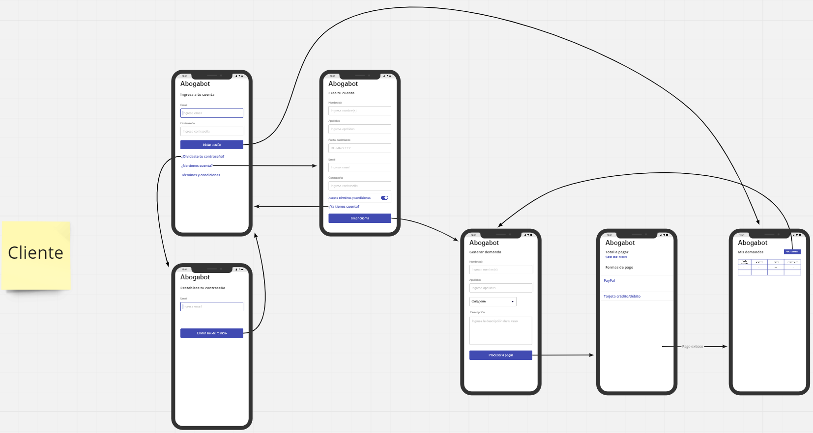
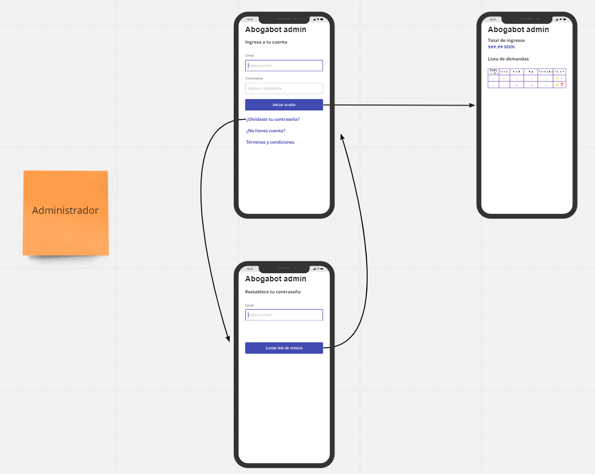

# Práctica Intro

## Caso abogabot

## Requerimientos

URL: [Requerimientos](https://docs.google.com/document/d/1tmvW7hjKOxMwTqPrh_aMjcwzOSOY7ldO/edit?usp=sharing&ouid=116676291786168504263&rtpof=true&sd=true)

## Buyer persona

URL: [Buyer Persona](https://drive.google.com/file/d/1wqwOuefno2_s7_UAoVa36yzEJKjrf-xi/view?usp=sharing)

## Público objetivo

URL: [Público objetivo](https://miro.com/app/board/uXjVOIWQbxY=/?invite_link_id=66782469702)

## Wireframes

## UI

URL: [Abogabot UI](https://www.figma.com/file/dbWd9LLxgtTsR1XmcACYYd/Abogabot-UI)
